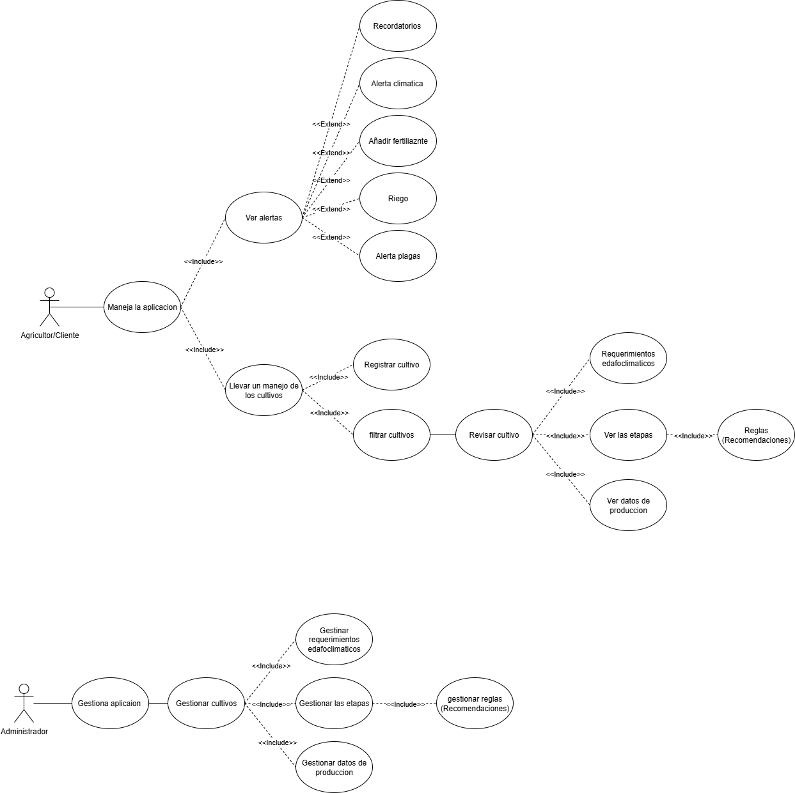
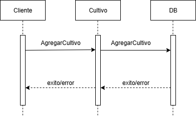
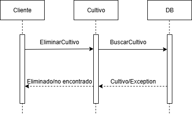
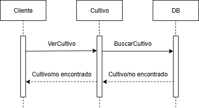
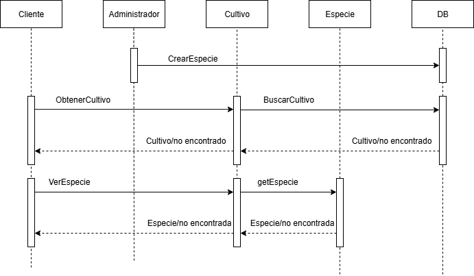
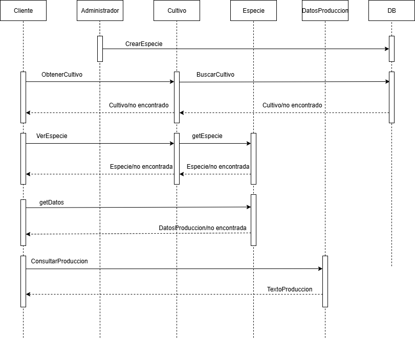

# UML - Diagramas del Proyecto de Gestión de Cultivos

En este documento se presentan los diagramas UML que ilustran el comportamiento y el diseño del sistema.

---

## 1. Diagrama Ad hoc

---

## 2. Diagrama de Casos de Uso

---

## 3. Diagramas de Secuencia (todos los casos de uso)
### 3.1 Diagrama de Secuencia - Caso de uso 1

### 3.2 Diagrama de Secuencia - Caso de uso 2

### 3.3 Diagrama de Secuencia - Caso de uso 3

### 3.4 Diagrama de Secuencia - Caso de uso 4

### 3.5 Diagrama de Secuencia - Caso de uso 5

### 3.6 Diagrama de Secuencia - Caso de uso 6

### 3.7 Diagrama de Secuencia - Caso de uso 7

### 3.8 Diagrama de Secuencia - Caso de uso 8

---

## 4. Diagrama de Modelo Relacional

---

## 5. Diagrama de Componentes

