# UML - Diagramas del Proyecto de Gestión de Cultivos

En este documento se presentan los diagramas UML que ilustran el comportamiento y el diseño del sistema.

---

## 1. Diagrama Ad hoc
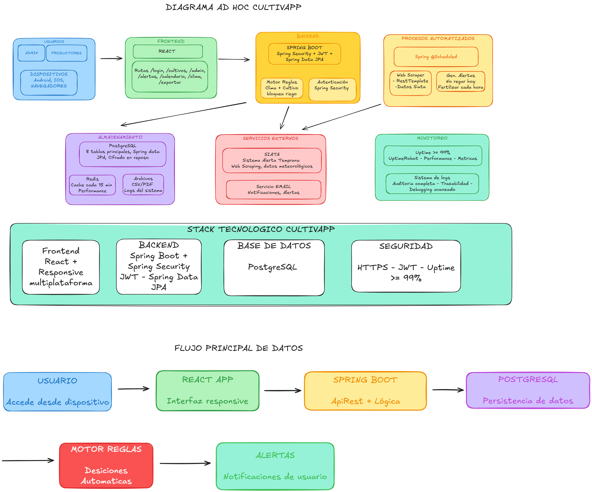

---

## 2. Diagrama de Casos de Uso
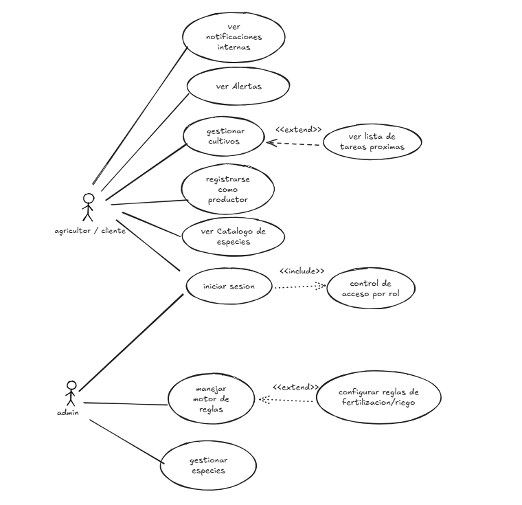

---

## 3. Diagramas de Secuencia (todos los casos de uso)
### 3.1 Diagrama de Secuencia - Caso de uso 1: Cliente se Logea

### 3.2 Diagrama de Secuencia - Caso de uso 2: Cliente se registra como productor
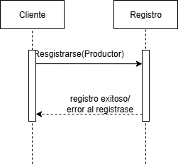

### 3.3 Diagrama de Secuencia - Caso de uso 3: Cliente ver las alertas
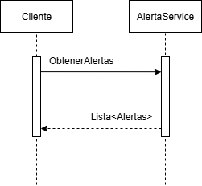

### 3.4 Diagrama de Secuencia - Caso de uso 4: Cliente ve cultivo
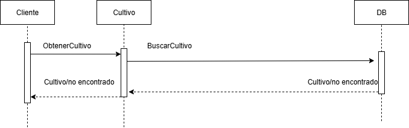

### 3.5 Diagrama de Secuencia - Caso de uso 4: Cliente ve tareas
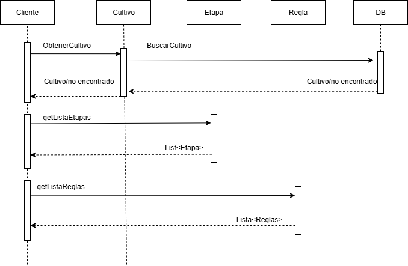

### 3.6 Diagrama de Secuencia - Caso de uso 5: Cliente ve notificaciones
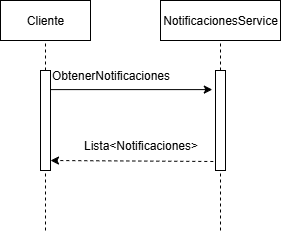

### 3.7 Diagrama de Secuencia - Caso de uso 6: Administrador se Logea
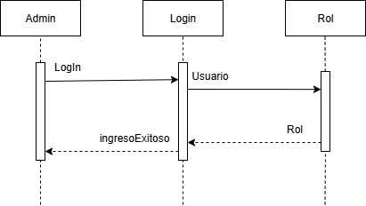

### 3.8 Diagrama de Secuencia - Caso de uso 7: Administrador maneja motor de reglas
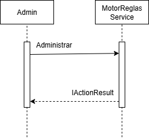

### 3.9 Diagrama de Secuencia - Caso de uso 8: Administrador configura las relgas de riego/fertilizacion
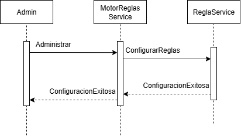

### 3.10 Diagrama de Secuencia - Caso de uso 8: Administrador gestiona especie
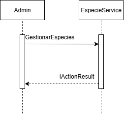

---

## 4. Diagrama de Modelo Relacional
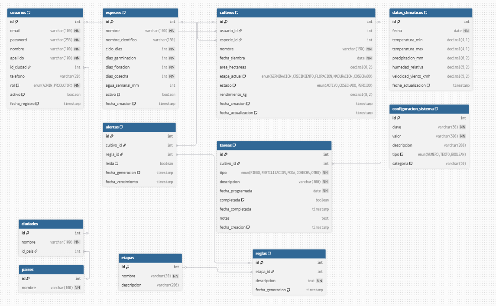 

---

## 5. Diagrama de Componentes
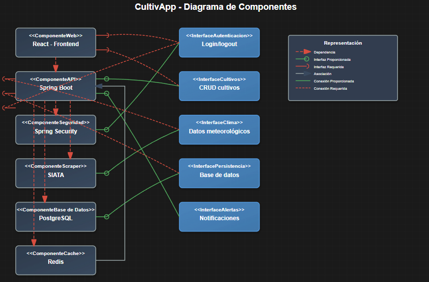 

