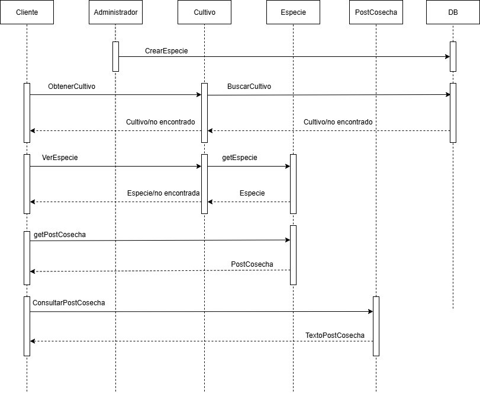
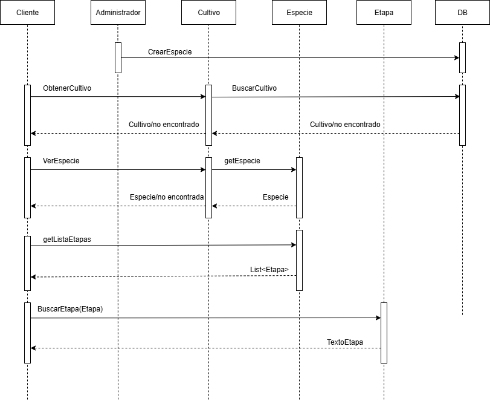
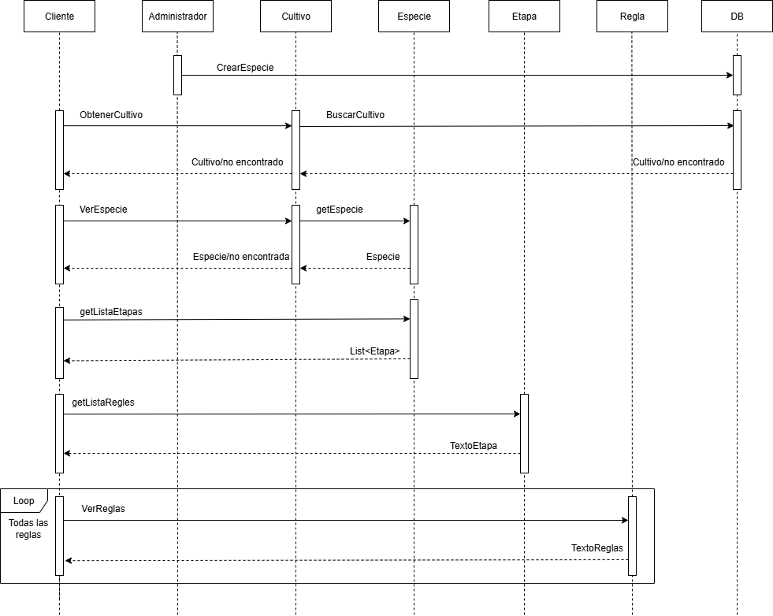
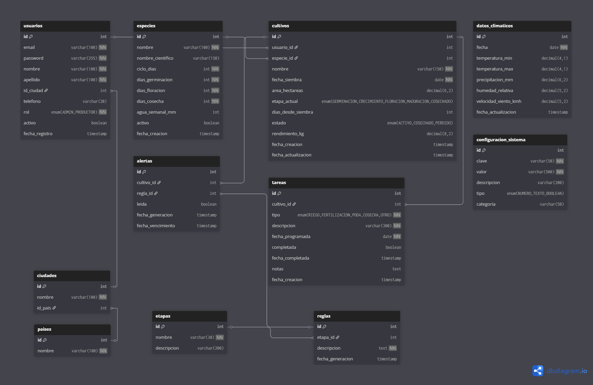

# UML - Diagramas del Proyecto de Gestión de Cultivos

En este documento se presentan los diagramas UML que ilustran el comportamiento y el diseño del sistema.

---

## 1. Diagrama Ad hoc

---

## 2. Diagrama de Casos de Uso

---

## 3. Diagramas de Secuencia (todos los casos de uso)
### 3.1 Diagrama de Secuencia - Caso de uso 1: Cliente Agregar cultivo

### 3.2 Diagrama de Secuencia - Caso de uso 2: Cliente Eliminar cultivo

### 3.3 Diagrama de Secuencia - Caso de uso 3: Cliente ver cultivo

### 3.4 Diagrama de Secuencia - Caso de uso 4: Cliente ver especie

### 3.5 Diagrama de Secuencia - Caso de uso 5: Cliente ver datos de produccion

### 3.6 Diagrama de Secuencia - Caso de uso 6: Cliente consultar post cosecha

### 3.7 Diagrama de Secuencia - Caso de uso 7: Cliente buscar etapa

### 3.8 Diagrama de Secuencia - Caso de uso 8: Cliente ver reglas

---

## 4. Diagrama de Modelo Relacional
 

---

## 5. Diagrama de Componentes
 

